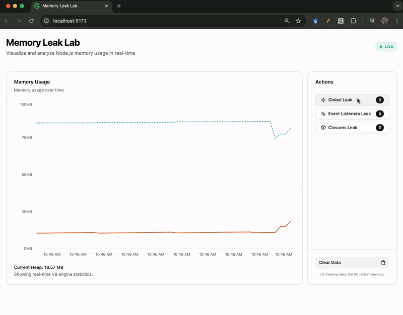

# Memory Leak Lab

## Overview

Memory Leak Lab is a controlled environment designed to simulate, monitor, and analyze memory leaks in Node.js applications. The project provides a real-time visualization dashboard to observe the behavior of the V8 engine's Garbage Collector when subjected to different memory consumption patterns, specifically focusing on the difference between Heap usage and Resident Set Size (RSS).



## Key Features

- **Real-time Monitoring**: Visualization of memory metrics using specialized charts.
- **Leak Simulation**: Trigger-based scenarios for Global Cache, Event Listeners, and Closures.
- **Architecture**: Modular Backend following SOLID principles and a modern Frontend using a component-based architecture.
- **Infrastructure**: Docker integration with resource constraints to simulate production-like Out-Of-Memory (OOM) conditions.

## Tech Stack

#### Backend

- **Node.js 22**: Utilizing native environment file management (--env-file).
- **TypeScript**: For static typing and enhanced developer experience.
- **Express**: Minimalist web framework for the API layer.
- **TSX**: TypeScript execution for development.

#### Frontend

- **React & Vite**: Fast build tool and component-based UI.
- **Tailwind CSS & Shadcn UI**: For a professional and responsive dashboard interface.
- **Recharts**: High-performance charting library for real-time data streaming.

#### Shared

- **Shared Types**: Common interfaces between Frontend and Backend to ensure type safety across the monorepo.

## Architecture

The project is organized as a monorepo using npm workspaces:
```
├── packages
│   ├── backend     # Express API and Leak Managers
│   ├── frontend    # React Dashboard
│   └── shared      # Common types and interfaces
├── docker-compose.yml
└── package.json
````

## Leak Scenarios

The laboratory implements three classic memory leak patterns:

- **Global Cache**: Simulates uncontrolled growth of static collections.
- **Event Listeners**: Demonstrates the accumulation of callbacks registered on long-lived objects (e.g., the process object).
- **Closures**: Illustrates how scope retention can prevent the Garbage Collector from reclaiming large data structures.

## Getting Started

#### Prerequisites
- Node.js 22.x or higher
- Docker and Docker Compose (optional, for containerized testing)

#### Installation

1. Clone the repository:
    ```sh 
    git clone <repository-url>
    cd memory-leak-lab
    ```

1. Install dependencies:
    ```sh
    npm install
    ```

#### Running Locally

1. Start the backend:
    ```sh
    npm run dev -w packages/backend
    ```

2. Start the frontend:
    ```sh
    npm run dev -w packages/frontend
    ```

#### Running with Docker

To simulate memory limits (e.g., 256MB limit), use Docker Compose:
```sh
npm run docker:up
```

## API Documentation

The backend exposes the following endpoints:

| Method | Endpoint | Description |
|--------|----------|-------------|
| GET | /api/v1/stats | Returns current memory statistics (Heap/RSS). |
| POST | /api/v1/leak/global-cache | Triggers a Global Cache leak. |
| POST | /api/v1/leak/events | Triggers an Event Listener leak. |
| POST | /api/v1/leak/closures | Triggers a Closure-based leak. |
| POST | /api/v1/leak/clear | Clears all managers to allow Garbage Collection. |

## License

This project is licensed under the MIT License.